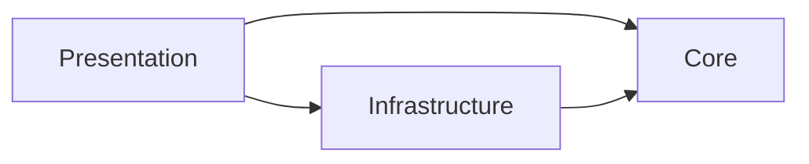

# Architecture

enlint separates evaluation policy from providers and presentation so the same
lint result can be used by different interfaces without changing its meaning.

## Design principles

- **Keep results reproducible.** Providers supply observations, but Core
  deterministically normalizes scores, calculates the overall score, derives
  issues, and selects a status.
- **Preserve evaluation evidence.** Confidence, probability distributions, raw
  levels, and usage remain available in the domain result even when the default
  text output does not display them.
- **Keep evaluation independent of presentation.** Core returns structured data
  and does not format text, choose colors, read process state, or call a
  provider SDK.

## Package and layers

The repository is one Deno package. A single package keeps the CLI, Core, and
provider adapters on one release version and avoids publishing internal layers
as separate artifacts. The `core/`, `infra/`, and presentation directories
express architectural boundaries:

| Layer          | Responsibility                                        |
| -------------- | ----------------------------------------------------- |
| Core           | Provider-independent evaluation policy and use cases  |
| Infrastructure | Translation between Core ports and external providers |
| Presentation   | Dependency composition, input handling, and output    |

Dependencies point inward. Core depends only on Core and Web-standard APIs, and
each presentation owns its composition root.

The repository lint rules in [`tools/lint_plugin.ts`](./tools/lint_plugin.ts)
define and enforce the exact directory-level dependencies. They also prevent
runtime-specific APIs in production Core modules and restrict each provider SDK
to a single adapter boundary file, keeping SDK-induced changes localized.

Production modules outside Core access it through `core/mod.ts`. Symbols not
re-exported there are Core implementation details. Repository-only tests and
tools may inspect internals when verifying those contracts.

Files and directories whose names begin with `_` are private to their containing
directory. Repository-only verification may make an explicit, documented
exception when it must compare an internal contract with shipped behavior.

## Evaluation boundaries

Core defines `Evaluator` and `Advisor` ports without provider types. Adapters
translate between those ports and provider wire formats. Responses are treated
as untrusted even when an SDK supplies static types, so adapters validate their
contents before returning domain values.

Evaluation definitions describe what to ask. Provider adapters own how those
definitions become requests. This keeps rubric and context changes independent
of a particular SDK and localizes SDK-specific changes at the provider boundary.

The CLI composes the concrete adapters. Linting uses only the evaluator;
explanations and rewrite candidates invoke the advisor only when requested.
Advisor failure does not discard a successful lint result.

## Test placement

The placement rule is whether a test calls an external service, not whether it
is an end-to-end test.

- Deterministic unit and integration tests live next to their modules as
  `*_test.ts` and run with `deno task test`.
- Tests that call real providers live under `tests/` and run only through the
  corresponding live task.
- See `tests/README.md` for live-test and calibration workflows.
